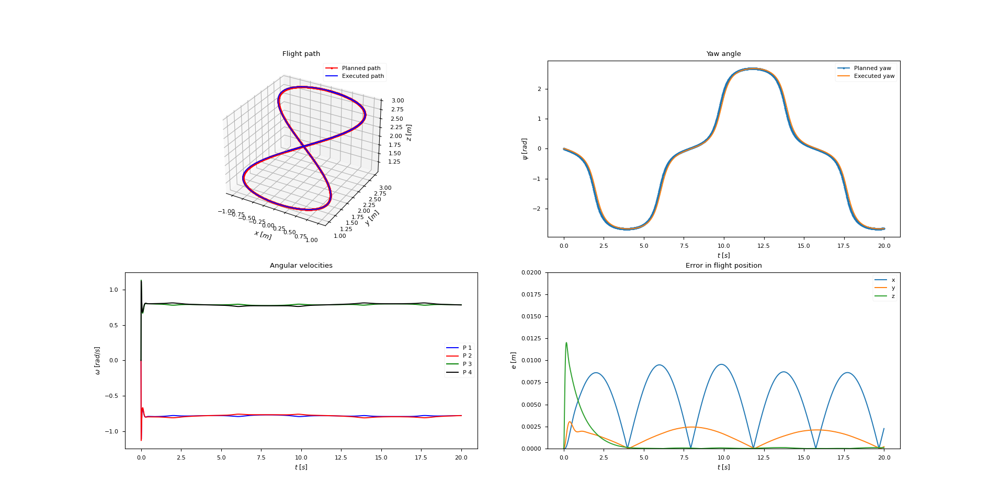
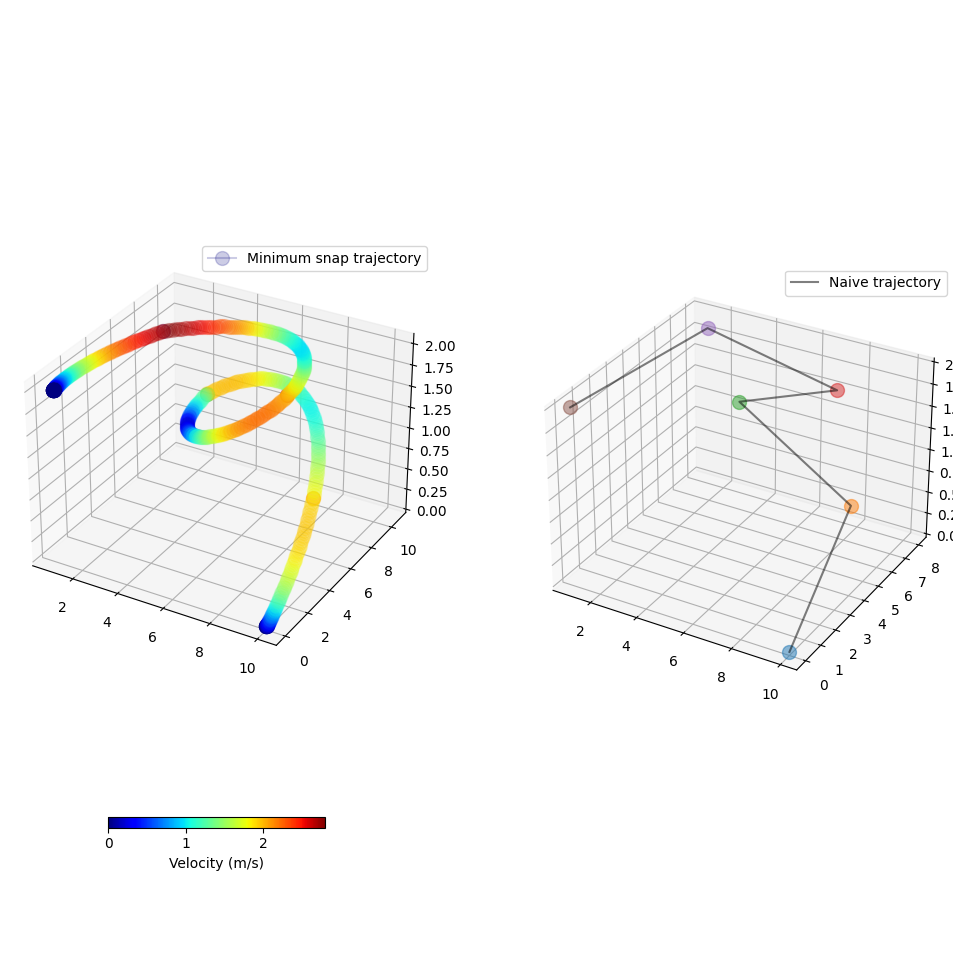
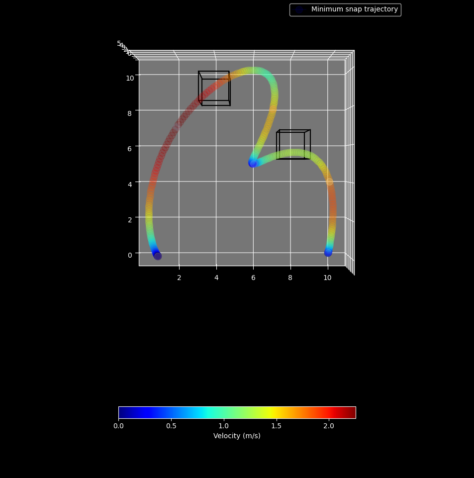
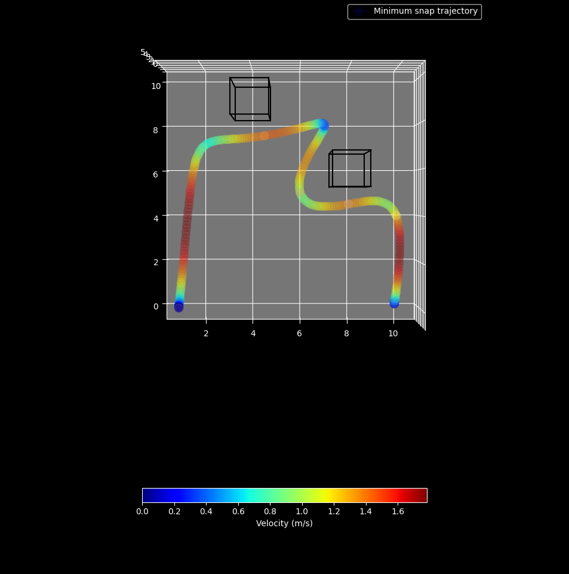

## 3D UAV simulation and autonomous control for path tracking
### Result on the Helix path
https://user-images.githubusercontent.com/17160701/209675444-38a1941d-f8d2-4477-b8ec-09222fa9c32d.mp4

### Result on the Figure 8 path

### 1. Control  

  

source: A platform for aerial robotics research and demonstration: The Flying Machine Arena  
Sergei Lupashin, Markus Hehn, Mark W. Mueller, Angela P. Schoellig, Michael Sherback, Raffaello D’Andrea

### 2. Trajectory Planner with minimum snap

Minimum Snap trajectory has been implemented for this project. Here are one a result for an arbritary trajectory, we can find the comparison between a naive trajectory (just connecting waypoints with a straight line) and the optimal one (Minimum snap)

#### Without collision check

#### With collision check (upper right waypoint is mandadory)

### To do
- [x] Simulation of 3D UAV Dynamics
    - [x] UAV Equation of motion
    - [x] State update
    - [x] 3D Visual
- [ ] Perception
- [ ] Estimation / Localization / Mapping
- [ ] Planning
    - [x] Minimum snap trajectory
    - [x] Colision free min snap trajectory (static obstacle in known environment)
    - [ ] Colision free min snap trajectory (in unknown environment or moving)
    - [ ] Colision free waypoints generation
- [x] Motion Control
    - [x] Altitude controller
    - [x] Lateral controller
    - [x] Roll/Pitch controller
    - [x] Yaw controller
    - [x] Body Rate controller